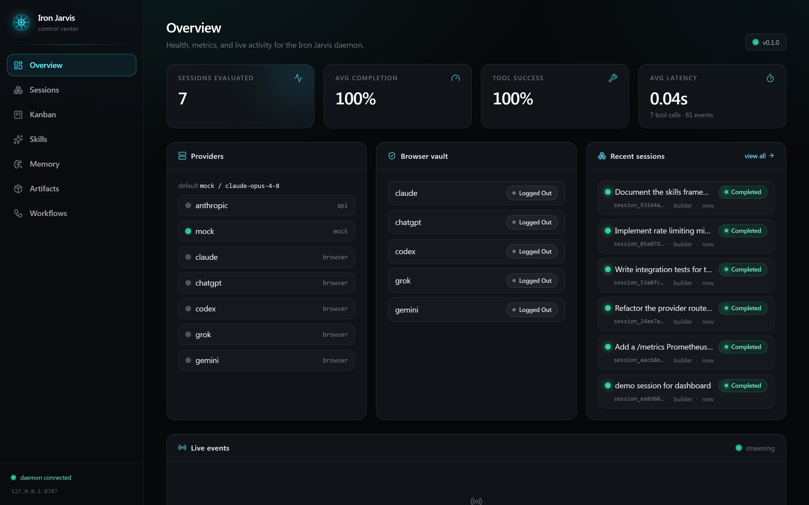
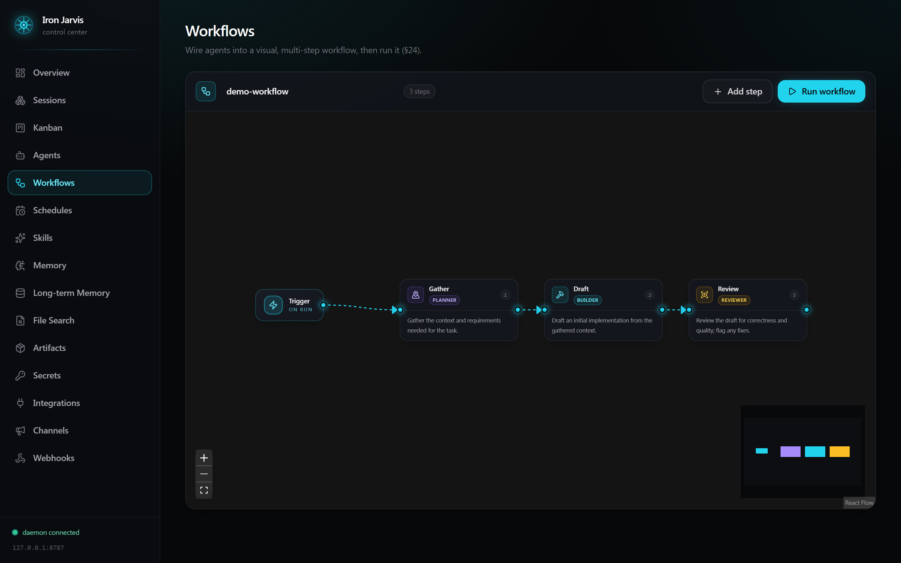
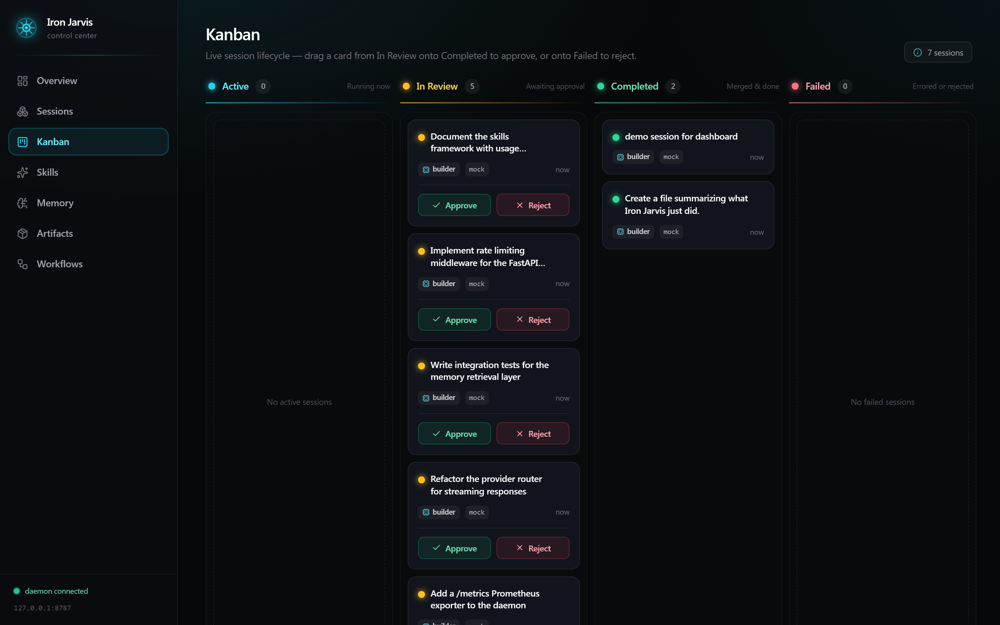

<div align="center">

# ⚡ IRON JARVIS

### Your own local-first AI operating system.

**Agents that plan, build, review, schedule, remember, and wire themselves into your world — running on *your* machine, under *your* control.**

No cloud lock-in. No black boxes. Every action logged, every change reviewable, every secret encrypted on your disk.

</div>

---

> **TL;DR** — Iron Jarvis turns a fleet of AI agents into a real operating system: a supervisor delegates to specialist subagents, work runs in sandboxed git worktrees you approve before merge, a layered memory + long-term knowledge base keeps context, and a beautiful Next.js control center (with an **n8n-style workflow canvas** and **voice-to-text**) lets you drive it all. Runs **fully offline** with a deterministic mock model — bring your own Claude key when you want the real thing.

<div align="center">



</div>

---

## 🔥 Why Iron Jarvis

You've used AI chat. This is the next thing: **AI that does the work and shows you exactly what it did.**

- **It's an OS, not a chatbot.** A Supervisor decomposes your goal, spins up specialist subagents (Planner, Builder, Reviewer, Researcher…), and each works in an isolated, disposable workspace.
- **You stay in control.** Every tool call passes a **fail-closed permission engine**. Risky actions ask first. Code changes land on a git branch and **never auto-merge** — you review the diff and approve.
- **It remembers.** Four-layer memory (session → project → user → org) plus pluggable **long-term memory** (Obsidian, Notion, or any markdown "brain").
- **It plugs into your world.** Encrypted secrets vault, integrations, Slack/Telegram/Discord alerts, inbound + outbound webhooks, cron-scheduled tasks, cross-drive file search.
- **Agents extend themselves.** They can create new agents, schedule their own jobs, add webhooks, write to long-term memory, and **build workflows you then see and edit on a visual canvas.**
- **Local-first & private.** SQLite by default, secrets encrypted at rest, sandboxed execution. The network is optional.

---

## ✨ Highlights

| | |
|---|---|
| 🧠 **Multi-agent orchestration** | Supervisor → subagents, isolated context, summarized results |
| 🔒 **Fail-closed permissions** | allow / ask / deny on every tool; `shell` stays locked down |
| 🌳 **Git-native sessions** | branch → work → diff → **you approve** → merge (no auto-merge) |
| 🧩 **n8n-style workflows** | drag step-nodes, wire them, run the graph — agents can build them too |
| 🎙️ **Voice-to-text** | hit the mic and dictate a prompt (local browser speech) |
| 🗝️ **Encrypted secrets vault** | API keys / OAuth / tokens, shared by every subsystem, never shown to agents |
| 📅 **Scheduled tasks** | friendly repeat presets or a specific date/time — no cron syntax required |
| 🔭 **Observability** | live event stream, traces, per-run evaluation metrics |
| 🖥️ **Beautiful dashboard** | arc-reactor dark UI, Kanban board, real-time everything |
| 📄 **Every file type** | read & write **PDF, Word, Excel, PowerPoint, CSV, Markdown, text** — like a colleague would |
| 🌱 **Self-correcting** | feedback → lessons injected into every future run; it gets **better each time** you use it |
| 🔌 **Connect a model in seconds** | a Connections page — paste an **API key** (Anthropic/OpenAI/Google) or sign in to **Google with OAuth 2.0 (PKCE)** |
| 🦙 **Or stay fully local** | point it at a local **Ollama** / OpenAI-compatible endpoint — real intelligence, no cloud, no key |
| 🔎 **Web search + MCP** | a keyless `web_search` tool for agents, plus an **MCP client** to consume external MCP servers as native tools |
| 🛠️ **Edits itself** | an opt-in **Maintainer** agent can read/edit/test/fix Iron Jarvis's own source on a review-gated worktree |
| ⏹️ **Full session control** | stop, rerun, continue (multi-turn), delete, and export any run; per-run **token usage** is tracked |
| 🖥️ **Multi-terminal workspace** | tiled live terminals with a **+ tile** to add more + a **directory tree** to pick a project per terminal |
| 🪟 **Runs as a desktop app** | an Electron wrapper opens the whole thing in a native window |
| 🤖 **Opt-in computer use** | gated, DOM-first browser automation with human-approval for risky actions |
| ✅ **436 offline tests** | the whole platform runs green with no network and no API keys |

<div align="center">



*The workflow canvas — agents can author these and you can drag the nodes around.*

</div>

---

## 🚀 Quickstart

```bash
# 0. Check your machine is ready (Python/uv/Node/pnpm/git/browser)
uv run ironjarvis doctor

# 1. Install + (optional) try it offline, no keys
uv sync --extra dev
uv run ironjarvis demo        # offline end-to-end across every subsystem
uv run pytest -q              # the full offline test suite, all green

# 2. ONE command to run everything (daemon :8787 + dashboard :3000, opens your browser)
uv run ironjarvis up
```

First time only, build the dashboard once: `cd dashboard && pnpm install && pnpm build`. After that, `ironjarvis up` launches both. Prefer two terminals? `uv run ironjarvis serve` + `cd dashboard && pnpm start`.

That's it. Open the dashboard, hit **New Session**, and watch agents work in real time.

**Connect a real model** — in the dashboard's **Connections** page or the CLI:
```bash
uv run ironjarvis connect anthropic sk-ant-...   # stored encrypted in the vault
# the provider flips to "available" instantly — sessions route to it, no env vars
```
- **API key** works for **Anthropic, OpenAI, and Google** — paste it and you're live.
- **OAuth 2.0 (PKCE)** sign-in currently applies to **Google/Gemini**, and (like any OAuth app) needs you to register your own Google Cloud OAuth client and store its `client_id`/`client_secret` in the vault. Anthropic/OpenAI use API keys.
- **Fully local?** Run a local **Ollama** (or any OpenAI-compatible server) and set `ollama_base_url` in config — no key, no network. Sessions can pick the `ollama` provider.

---

## ☁️ Deploy to your own server (optional)

Want it always-on? Ship it to a VPS in a couple of clicks — **full guide + one-click buttons in [`DEPLOY.md`](DEPLOY.md)** (Render, Railway, DigitalOcean, AWS, Azure).

[](https://render.com/deploy?repo=https://github.com/RealDealCPA-VR/Iron-Jarvis) [](https://cloud.digitalocean.com/apps/new?repo=https://github.com/RealDealCPA-VR/Iron-Jarvis/tree/master)

*(The Render and DigitalOcean buttons carry this repo. **Railway** works too — follow the manual steps in [`DEPLOY.md`](DEPLOY.md); the generic "deploy on Railway" button doesn't carry a repo, so we link the guide instead of a one-click that wouldn't.)*

```bash
docker compose up        # daemon + dashboard, locally or on any Docker host
```

> 🔒 **Before exposing it publicly:** set `IRONJARVIS_TOKEN` (protects the API — it's RCE-by-design), serve over HTTPS, set `IRONJARVIS_CORS_ORIGINS` to your dashboard origin, persist `.ironjarvis/` on a volume, and keep **computer use off** unless you run it in a disposable VM. The `DEPLOY.md` security checklist walks through it.

---

## 📖 Using Iron Jarvis — a practical guide

### Run it as a desktop app 🪟
Prefer a native window over a browser tab? An Electron wrapper boots the daemon + dashboard and shows them in one app:
```bash
cd dashboard && pnpm install && pnpm build   # once
cd ../desktop  && pnpm install && pnpm start  # opens Iron Jarvis in a native window
```

### Manage multiple terminals (and pick a project) 🖥️
**Dashboard → Terminals.** A tiled workspace of **live terminal sessions** — click the **`+` tile** to open another, so you can run/watch several agents or shells side by side. The **directory tree on the right** browses your computer (drives → folders, with git/python/node project badges); pick a folder and hit **"Open terminal here →"** to launch a terminal already `cd`'d into that project. Real PTYs (ConPTY on Windows), streamed over WebSocket.

### Run a session (and dictate it 🎙️)
**Dashboard → Sessions → New session.** Type a task — or **click an example chip**, **click the mic and speak it**, or **attach a file** for the agent to read. Pick an agent type (`builder`, `supervisor`, …) and a provider, then **Run**. The run streams its tool calls and events **live** on the session page. You can **Stop** a runaway run, **Rerun** it, **Continue** it (a multi-turn follow-up that reuses the workspace), **Export** the transcript (Markdown/JSON), or **Delete** it — and every run shows its **token usage**. Or from the terminal:
```bash
uv run ironjarvis run "Summarize the quarterly financials and draft an email"
uv run ironjarvis cancel <session-id>     # stop a background run
uv run ironjarvis rerun  <session-id>     # clone its inputs and run again
```

### Settings, Self-development & Help
**Dashboard → Settings** edits the safe config keys (default model, sandbox runtime, self-dev, local Ollama endpoint…) without touching `config.toml`, and holds the **daemon access-token** box so you can log into a deployed instance without a rebuild. **Dashboard → Self-development** shows whether the Maintainer can edit Iron Jarvis's own source and starts a review-gated session. **Dashboard → Help** is an in-app guide to every subsystem. A **🔔 bell** in the top bar surfaces pending reviews and computer-use approvals.

### Watch it on the Kanban board
**Dashboard → Kanban.** Sessions flow across **Active → In Review → Completed / Failed** lanes. For git-native sessions, **drag a card from In Review onto Completed to approve** (merge) or onto Failed to reject. Approve/Reject buttons are on each review card too.

### Build a workflow visually (n8n-style)
**Dashboard → Workflows.** Drag step-nodes onto the canvas, wire `Trigger → Gather → Draft → Review`, set each node's agent + task (mic included), and hit **Run workflow** — each step spawns a session. **Load** a saved workflow to edit it, **Save** your own. *Agents can create workflows here too — when one does, it appears on your canvas to inspect and manipulate.*

### Let agents extend themselves
Agents have self-service tools, so a single high-level task can ripple out:
- `schedule_create` — an agent schedules a recurring job for itself
- `webhook_add` — an agent wires an inbound/outbound webhook
- `ltm_append` / `ltm_search` — an agent writes to & queries long-term memory
- `file_search` — an agent searches across your drives
- `workflow_create` — an agent authors a workflow **you then see and edit visually**
- `create_agent` / `spawn_agent` — agents that add more agents (now on the **same model** as the parent, not the mock)
- `web_search` — a keyless web search (DuckDuckGo by default; Brave with a vault key)
- **MCP tools** — any configured MCP server's tools appear as `mcp__<server>__<tool>` and are callable like native tools

### Fix Iron Jarvis with Iron Jarvis (self-development)
Opt-in (`self_dev_enabled` in config, or `--enable`): a **Maintainer** agent edits Iron Jarvis's *own* source on a git worktree. Changes are **review-gated — never auto-merged**; you approve the diff. Surfaces: `ironjarvis self-dev "fix X" --enable`, the **Self-development** dashboard page, or `POST /sessions {self_dev:true}`.

### Run it locally, no cloud (Ollama)
Set `ollama_base_url` in config (e.g. `http://localhost:11434/v1/chat/completions`) to route sessions through a local **Ollama** / OpenAI-compatible model — real intelligence with **no API key and no network**.

### Schedules (no cron required)
**Dashboard → Schedules.** Pick a **Repeat** preset (Hourly, Daily 9am, Weekdays 9am…) or choose **Once at a specific time** with a date picker. Each fire can run a workflow or emit an event.
```bash
uv run ironjarvis schedule-add nightly-books "0 2 * * *" --kind workflow
```

### Long-term memory (bring your own brain)
**Dashboard → Long-term Memory.** Search and append notes. **Add a custom source** — point it at an Obsidian vault / any markdown folder, or a Notion database (token from the vault). Custom sources show up in the search filter instantly.
```bash
uv run ironjarvis ltm-append "Client checklist" "EIN, prior returns, bank statements"
uv run ironjarvis ltm-search "onboarding"
```

### Secrets, integrations & channels
- **Secrets** — encrypted vault; values are write-only and never shown to agents or the UI.
- **Integrations** — enable / configure / **test** external services (each bound to a secret).
- **Channels** — connect Slack / Telegram / Discord; Iron Jarvis auto-alerts on review-requested, workflow-completed, and provider-failed events.

### Webhooks & file search
- **Webhooks** — **+ Add webhook** (inbound or outbound, HMAC-signed); inbound gives you a `POST /webhooks/{slug}` trigger URL.
- **File Search** — pick a **drive** (C:, D:, Home…) or a folder and search by name, content, or semantics.

> **CLI cheat sheet:** `init · serve · up · run · self-dev · demo · cancel · rerun · delete-session · backup · restore · rotate-keys · prune-events · prune-worktrees · migrate · metrics · evaluate · memory-search · ltm-search · ltm-append · file-search · schedule-add · schedules · secrets · integrations · agents · create-agent · notify · workflow · doctor · connect · status`

---

## 🏗️ Architecture

```
Dashboard (Next.js)  ──REST + WebSocket──►  Daemon (FastAPI)
                                              │  owns the Orchestrator + Event Bus
        ┌─────────────────────────────────────┼───────────────────────────────┐
   Orchestrator → Agent Runtime          Model Router → Provider Manager → Vault
        │                                      │
   Tool Registry + Permission Engine     Memory · Long-term Memory · Retrieval
        │                                      │
   Sandbox · Git/Review · Workflows · Scheduler · Webhooks · Integrations · Comm
        └──────────────── Event Bus · Evaluation · Observability ──────────────┘
                  Persistence: SQLite (WAL, self-healing additive migrations)
                  — the only backend today; Postgres+pgvector is a planned
                  engine-URL swap, not yet implemented.
```

```
src/iron_jarvis/
  core/        config, events, db, models, logging, ids
  tools/       registry, permissions (fail-closed), builtins
  providers/   manager, router, vault, adapters/{mock,anthropic}
  agents/      runtime, orchestrator, supervisor, dynamic agents
  sandbox/     native + Docker execution, §17 policies
  memory/      4-layer memory + numpy retrieval
  ltm/         Obsidian / Notion / markdown-brain connectors
  secrets/     Fernet-encrypted shared vault
  integrations/ comm/ webhooks/ scheduling/ filesearch/   (the "robust" layer)
  git/         worktree sessions + review engine
  workflows/   engine + triggers + persisted defs
  eval/        evaluation + observability
  daemon/      FastAPI app (REST + WS) + Typer CLI
dashboard/     Next.js 15 control center (Kanban, n8n canvas, voice)
```

Built from `SPEC.MD` (§10–33) + reconstructed `SPEC-SECTIONS-01-09.md`. See `PLAN.md` / `TASKS.md` for the build log.

---

## 🛡️ Security & privacy

- **Local-first.** All state lives under `.ironjarvis/` on your machine. The network is opt-in.
- **Fail-closed.** Unknown or unconfigured tool → denied. `shell` and other dangerous tools never auto-run headless.
- **Secrets encrypted at rest** (Fernet); agents can set/list names but **never read values**.
- **No auto-merge.** Agents stop at the diff; humans approve.
- **Sandboxed execution.** Structured file tools are workspace-confined; the **Docker** runtime adds a real filesystem/network/resource boundary (workspace-only mount, fail-closed network, CPU/memory/pid caps). The **native** runtime is best-effort (env scrubbing + timeouts only) — when an isolating policy is set, the shell tool prefers Docker and clearly flags any native fallback as unconfined. `shell` itself stays permission-gated (fail-closed headless).

---

## ✅ Proof it works

- **436 offline tests pass** (`uv run pytest -q`) — no network, no keys.
- Live daemon serves every endpoint; the dashboard has a clean production build.
- Real-Chrome screenshots of every page live in [`dashboard/proof/`](dashboard/proof/).

<div align="center">



</div>

---

## 🗺️ Roadmap

Voice *output*, a mobile companion, distributed agent clusters, a skills/agent marketplace, and team-shared org memory. The foundation is built — everything else stacks on top.

---

<div align="center">

**Iron Jarvis** — *the AI operating system you actually own.*

Built with [Claude Code](https://claude.com/claude-code).

</div>
