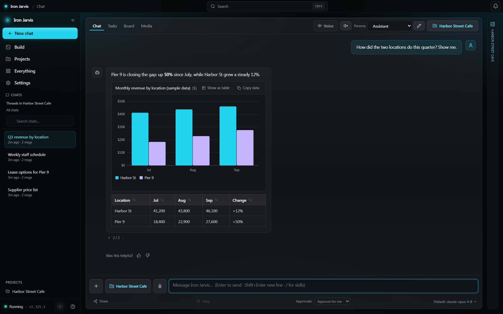
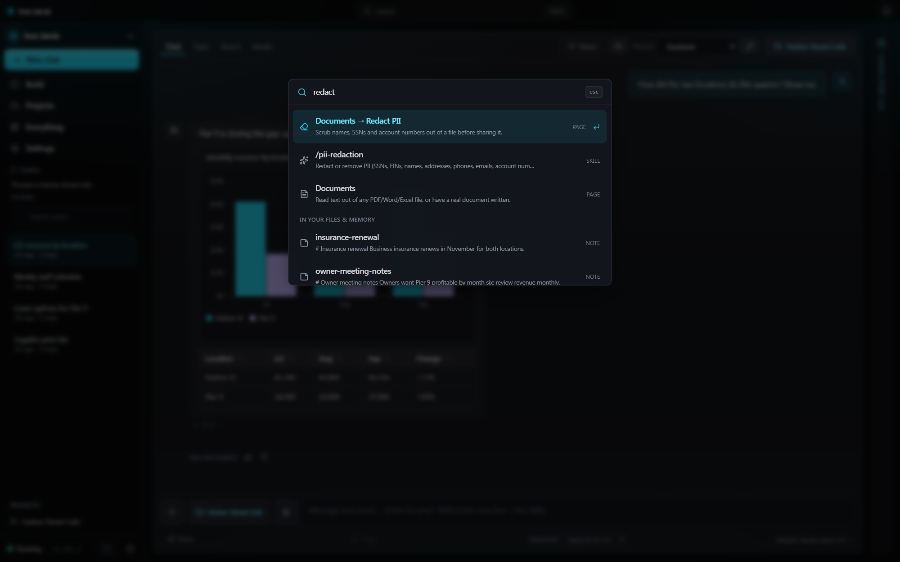
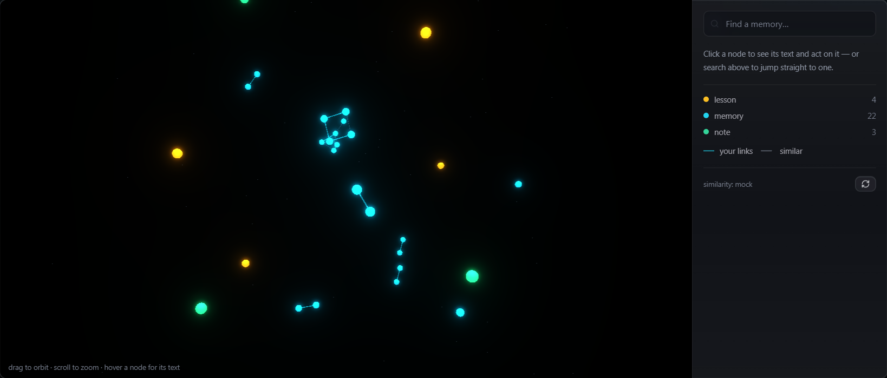

<div align="center">

# ⚡ IRON JARVIS

[](https://github.com/RealDealCPA-VR/Iron-Jarvis/actions/workflows/tests.yml)
[](https://github.com/RealDealCPA-VR/Iron-Jarvis/releases/latest)

[](LICENSE)

### The AI operating system you actually own.

**One chat. A team of agents behind it. Your files, your models, your machine.**

Every action logged. Every change reviewable. Every secret encrypted on your disk.

</div>

---

Iron Jarvis is a desktop app that turns AI models into a working system: **a chat that answers in seconds and quietly hands real work to a full tool-using agent**, a team of specialist agents you give one objective to, terminals running Claude Code or Codex side by side, schedules, workflows, memory, and documents. It runs on **your** computer. Bring an API key, your existing Claude or ChatGPT subscription login, or your own GPUs. Or run it fully offline with a built-in demo model.

<div align="center">



*A reply with a chart and a sortable table. "‹ 2 / 2 ›" means the earlier answer was kept, not thrown away. (Sample data.)*

</div>

## 🔥 Why it's different

- **It does the work and shows its receipts.** Every reply says which model answered it, which tools ran, and which files it made. A tool the turn wasn't given is refused and recorded, never quietly run.
- **There's no mode picker.** You just ask. A quick question gets a quick answer, and a job that needs files, tools and several steps turns into a full agent run on its own, with the reason shown.
- **It never moves your data behind your back.** If your local model is down, it says so **by name** instead of quietly sending your conversation to a cloud API. Only **Auto**, if you pick it, may switch providers.
- **You approve what matters.** Risky actions ask first. Code changes land on a git branch and **never auto-merge**. Reversible actions (file writes, documents, notes, settings) have an **Undo**.
- **Local-first.** SQLite on your disk, secrets encrypted at rest, sandboxed execution. The network is optional.

---

## ✨ Highlights

### 💬 Chat that keeps up with you
- **One surface for everything.** Type **/** for a skill, drop files anywhere, and pick a project so every reply grounds in its brief, instructions, folder and knowledge.
- **Charts and tables in replies.** Answers can include bar, line and pie charts you can flip to a table. Tables sort when you press a column heading and copy or download as CSV.
- **Nothing gets lost.** Editing a question or pressing Try again keeps the old answer, and **‹ 1 / 2 ›** flips between them. You can also retry one reply with a different model.
- **Keeps up while it works.** Steer a reply mid-answer, or queue your next message (**Ctrl+Enter**) to send when this one finishes. You can also quote part of an answer, **Continue** a reply that was cut off, and see the model's thinking separately from its answer.
- **Ask about this page.** Press **Ctrl K** on any screen and type "explain this page". What that page shows goes along with your next question.
- **Change settings by asking.** Say "turn on follow-up suggestions" and a card shows what changed, with **Undo**. Protected settings always ask first, and keys go into a secure box instead of the chat.
- **Voice, offline.** Speech-to-text is bundled (Vosk), so dictation works with no key and no cloud.

### 🤖 Agents that do real work
- **Missions.** Give the team one objective. Jarvis splits it among specialist agents (planner, builder, reviewer, researcher and so on). Progress only shows a number when it counts finished steps, and the finished deliverable is shown first.
- **Agents you can hire.** A custom agent gets a job card, a monthly budget that pauses it when spent, its own notes folder, and a coach that suggests better instructions for you to accept or decline.
- **Build.** Tiled live terminals for Claude Code, Codex, Grok and your shells. A pane keeps running when you leave the page.
- **Many accounts, one switch.** The bundled [Iron-Proxy](https://github.com/RealDealCPA-VR/Iron-Proxy) holds several Claude, Codex or Grok logins. When one hits its limit, the next one takes over, but never a different provider. In Build, **Continue on the next account** carries a Claude Code conversation over.
- **Automations without cron.** Schedules, a visual workflow canvas, webhooks, and triggers that start work from email, calendar or Slack. Agents can create schedules, workflows and webhooks too, and you can see and edit what they made.
- **Fixes itself.** An opt-in Maintainer agent edits Iron Jarvis's own source on a review-gated branch.

### 🧠 It knows you and your stuff
- **One you, every model.** A **You** page sets who you are, how answers should read, and the language they come back in. Every model in chat, on your phone and inside agents gets it.
- **It learns what you prefer.** Say "from now on…" and it remembers, then shows that on the receipt. Correct it the same way twice and it asks once whether to keep the rule. It can also share your profile with Claude Code and Codex in Build if you switch that on.
- **Memory you can touch.** Four memory layers, plus bases you plug in with **Add a memory base**: a folder or Obsidian vault, Notion, cloud drives, a machine over SSH, or an MCP memory server. Each project picks its own. All of it renders as a 3D graph.
- **Every file type.** Read and write PDF, Word, Excel, PowerPoint, CSV and Markdown. Scanned pages are found page by page. **PII redaction** really deletes the text from a PDF and re-reads the result to prove it's gone.
- **Creative studio.** Generate images, video, music and speech, and browse your own media folders.

### 🔌 It plugs into your world
- 🌐 **Your own browser, as a capability.** The installer ships a small browser **add-on** for Chrome or Edge. Pair it and ask about the page in front of you, or let it click, type and navigate. Anything that looks destructive or transactional stops and asks first. Page text is treated as data, so a page can't give Jarvis orders, and form values are never collected. Whatever harness you pick in **Build** drives the *same* browser through the same gates.
- 📱 **Chat from your phone.** Text your Telegram bot like a person. It has the same memory and tools behind a sender allowlist, and the conversation shows up in the desktop chat.
- 🧩 **MCP apps.** MCP servers become tools in chat and in agents. A server can ask you a question or report progress, and you answer it right in the chat. A tool a server adds later that can write is held until you approve it.
- 🖥️ **Your own GPUs, watched live.** Tokens/sec, queue, VRAM and context windows for every local server you run. A number it can't read says so rather than showing zero.

### 🛡️ Trust you can check
- 🧾 **The roster is the contract, no cloud by fallback, honest outcomes.** An agent or chat can only call the tools it was given; anything else is refused and logged as *not armed*. A local model that is down or errors refuses **by name** instead of failing over to a cloud API (`local_primary_policy = refuse` by default; Auto is the one route that may substitute). And every finished run carries an outcome beside its status (*completed*, *with failures* or *needs you*) taken from the ledger, never from the model's closing paragraph.
- **The bell** lists every run that is waiting for you, and an ask nobody answered ends up on the session's outcome (*needs you*), not in a forgotten corner.
- **Context is screened.** Project notes, attachments, outside skills, memory and tool results are scanned for hidden instructions before a model sees them. Work that arrives from your phone, or touches flagged content, runs with fewer powers.
- **Safety checks** run rules over what Jarvis did, and over your Claude Code and Codex history, which it reads but never changes. **Activity** replays every action, token and decision, and is where you Undo.

<div align="center">



*Ctrl K reaches every page, skill, chat and buried setting, and always ends with "Ask Iron Jarvis".*

</div>

---

## 📦 Install

### 🪟 Windows desktop app (recommended, no dependencies)

1. **Download** `Iron-Jarvis-Setup-<version>.exe` from the **[latest release](https://github.com/RealDealCPA-VR/Iron-Jarvis/releases/latest)**. Ignore the `.blockmap` and `latest.yml` files; the updater uses those.
2. **Install.** The app isn't code-signed yet ([why](docs/SIGNING.md)), so SmartScreen shows *"Windows protected your PC"*. Click **More info → Run anyway**.
3. **Connect a model.** The app opens on chat. If you're signed in to the `claude` or `codex` CLI, or Ollama is running, the composer offers that model with one tap. It never picks one for you. You can also paste an API key (Anthropic, OpenAI, xAI, OpenRouter), point it at a local Ollama / vLLM / LM Studio / OpenAI-compatible server, or connect Gemini with your own Google OAuth app under **Settings → Connections**. Until you choose a model, a **Simulated mode** strip reminds you that replies come from the offline demo.

Iron Jarvis inherits your subscription through the logged-in CLI. It never performs an account login itself and never sees that credential.

**Day to day**
- **Closing the window doesn't quit.** It goes to the tray so schedules and triggers keep running. Reopen it with **Ctrl+Shift+J** (or **Ctrl+Alt+J** if another app holds that). **Ctrl+Shift+Space** opens a quick ask from anywhere.
- **Updates install themselves.** New versions download in the background and install when you click **Restart to update**.
- **Your data lives in `%APPDATA%\Iron Jarvis`** and survives updates and reinstalls.

**If something looks wrong:** *"Daemon offline"* only appears after two missed polls. If it stays, quit from the tray and relaunch (or tray → **Restart Iron Jarvis**), then go to **Settings → Maintenance → Copy diagnostics / Open logs folder** to see why. `ironjarvis doctor`, `repair`, `rollback`, `reset-config` and `backup`/`restore` are one-command recoveries that work even when the daemon won't start.

### 💻 From source (macOS / Linux / Windows)

Needs **Python 3.12+**, [uv](https://docs.astral.sh/uv/), **Node 20+** and [pnpm](https://pnpm.io/).

```bash
git clone https://github.com/RealDealCPA-VR/Iron-Jarvis && cd Iron-Jarvis
uv sync --extra dev
cd dashboard && pnpm install && pnpm build && cd ..
uv run ironjarvis up          # daemon + dashboard, opens your browser
```

No keys? `uv run ironjarvis demo` runs end to end with the offline demo model. To run it on a server, see [`DEPLOY.md`](DEPLOY.md) (Docker Compose, Render, Railway, DigitalOcean, AWS, Azure). The API runs code by design, so read the security checklist there first.

---

## 🏗️ Under the hood

```
Desktop (Electron) ── tray · updates · hotkeys · pop-out windows
   ├─ Dashboard (Next.js 15) ── chat, Build, projects, missions, memory graph, settings
   └─ Daemon (FastAPI, 127.0.0.1:8787, token-protected)
        ├─ Router ── providers · strict local refusal · breaker · Iron-Proxy accounts
        ├─ Agents ── runtime · missions · assignments · coach · trust posture
        ├─ Tools ── fail-closed permissions · undo journal · sandbox · MCP
        ├─ Memory ── 4 layers · memory bases · lessons · graph
        └─ Automations ── schedules · workflows · webhooks · triggers
   SQLite (WAL, self-healing migrations) · Fernet-encrypted vault
```

**Proof, not promises:** more than 11,000 backend tests and 4,000 dashboard tests run **offline** with no keys. CI runs them on every push and blocks the installer until they pass. The live count is on the [Tests badge](https://github.com/RealDealCPA-VR/Iron-Jarvis/actions/workflows/tests.yml).

<div align="center">



*The memory graph: lessons, memories and notes as nodes. Solid lines are links you drew; dashed ones are computed similarity. Click a node to read it, connect it or prune it.*

</div>

## 📚 Learn more

- **[The Handbook](docs/HANDBOOK.md)** covers every surface, the trust model and troubleshooting.
- **[Recommended settings](docs/RECOMMENDED-SETTINGS.md)** is a tuned daily-driver setup.
- **[Local models by RAM tier](docs/LOCAL-MODELS.md)** says what to run at 8–128 GB and how to connect it.
- **[What's next](docs/TODO.md)** lists everything still open.

## License

**Free to use**, personally or inside your business, under [Apache 2.0 with the Commons Clause](LICENSE). You may use, modify and share it. You may **not sell it**, offer it as a paid or hosted service, or sell products whose value comes substantially from it. That makes it *source-available*, not OSI open source. Want to do something commercial? Open an issue and ask.

<div align="center">

**Iron Jarvis**: *the AI operating system you actually own.*

Built with [Claude Code](https://claude.com/claude-code).

</div>
